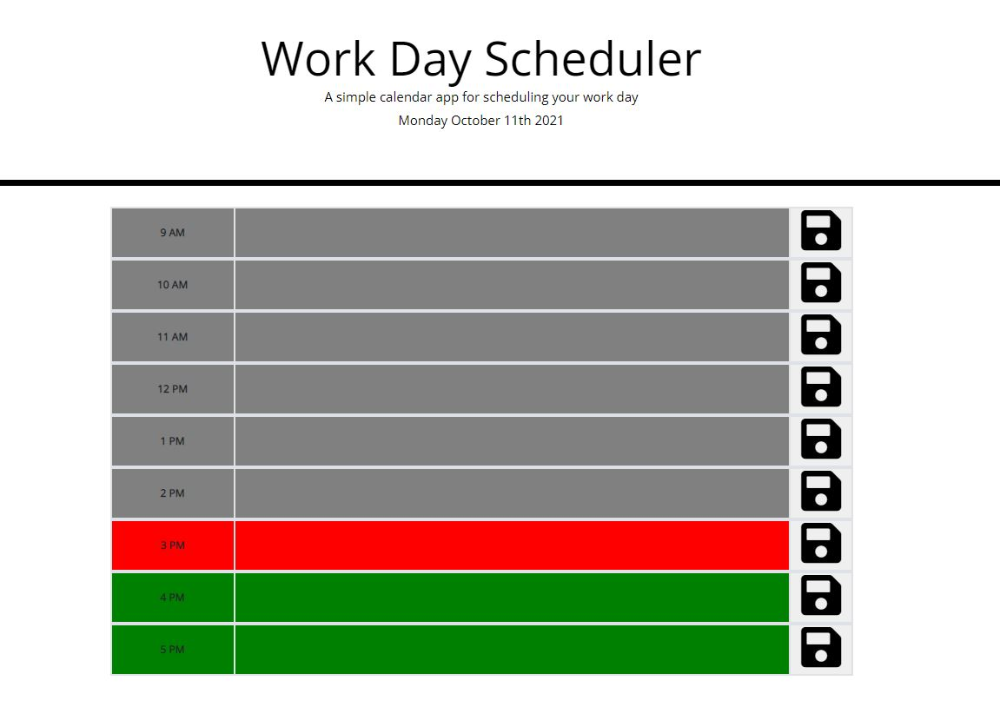
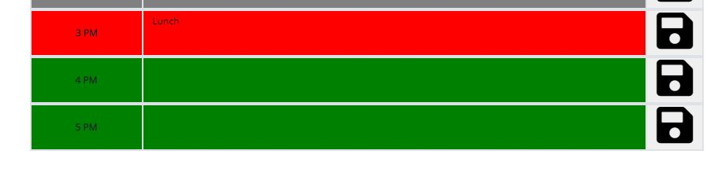

# work-day-scheduler

For this project, I modified an existing repository so that when the Work Day Scheduler page is loaded, the date appears at the top and a scheduler displaying the standard workday hours appears.  I was provided an index.html and style.css files as starting points and needed to add on to the html file and then create a corresponding script.js file to perform different actions on the page.  I color-coded each row, using functions, based on if that hour is in the past (gray), current hour block (red), or future (green).  I also needed to create functions that would allow the user to input text and then click the save button, saving it in the Scheduler.  Finally, I needed to save the content to local storage so that the tasks logged would be saved and displayed when the page is refreshed.

## Snapshot

Content is saved to local storage and accessible even when the page is refreshed:

## Built With

* [Visual Studio Code](https://code.visualstudio.com/) - to create and modify the code on my local device
* [HTML](https://developer.mozilla.org/en-US/docs/Web/HTML) - to create elements
* [CSS](https://developer.mozilla.org/en-US/docs/Web/CSS) - to style the html elements
* [Javascript](https://www.javascript.com/) - to create actions on the page
* [jQuery](https://jquery.com/) - to add actions to the page
* [Bootstrap](https://getbootstrap.com/) - style the page
* [Git](https://git-scm.com/) - to track changes and push commits
* [GitHub](github.com) - to host the repository and deploy with GitHub pages

## Deployed Link

* [https://kiri-smith.github.io/work-day-scheduler/](#)

## Author

* Kiri Smith 

- [https://kiri-smith.github.io/](#)
- [https://github.com/kiri-smith](https://github.com/)
- [https://www.linkedin.com/in/kiri-lynne-smith/](https://www.linkedin.com/)

## License

This project is licensed under the MIT License.

## Acknowledgments

* Jerome Chenette - for imparting tips, tricks, and wisdom of coding with my cohort
* My peers - for answering questions, pushing me to excel and supporting this journey
* Cheng Tang - for assistance debugging
* Sara Neves Pereira - for assistance with final debugging
